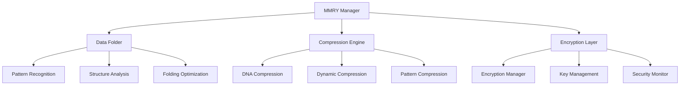

# MMRY System Documentation

## Table of Contents
1. [Overview](#overview)
2. [System Architecture](#system-architecture)
3. [DNA-Inspired Data Folding](#dna-inspired-data-folding)
4. [Compression System](#compression-system)
5. [Encryption Layer](#encryption-layer)
6. [Storage Management](#storage-management)
7. [Indexing and Retrieval](#indexing-and-retrieval)
8. [Performance Optimization](#performance-optimization)
9. [Security Considerations](#security-considerations)
10. [File Locations](#file-locations)
11. [Usage Examples](#usage-examples)

## Overview

The MMRY System provides advanced memory management with DNA-inspired data folding compression, secure encryption, and efficient indexing for large-scale dense storage. It optimizes data storage and retrieval while maintaining data integrity and security.

### Key Features
- DNA-inspired data folding compression
- Multi-layer encryption options
- Dynamic compression ratios
- Selective data retrieval
- Dense storage optimization
- Pattern-based indexing
- Backup automation
- Version control integration

## System Architecture



### Data Flow
1. Data input received
2. Pattern analysis performed
3. Folding strategy determined
4. Compression applied
5. Encryption layer added
6. Storage optimization
7. Index generation

## DNA-Inspired Data Folding

### 1. Pattern Recognition
```python
class DNAPatternAnalyzer:
    """
    Analyzes data patterns for optimal folding
    """
    def analyze_pattern(self, data: bytes) -> PatternMap:
        """
        Identifies repeating patterns and structures:
        - Sequence patterns
        - Structural similarities
        - Folding opportunities
        """
        pass

    def optimize_folding(self, pattern_map: PatternMap) -> FoldingStrategy:
        """
        Determines optimal folding strategy:
        - Pattern-based folding
        - Structure-based compression
        - Hybrid approaches
        """
        pass
```

### 2. Folding Implementation
```python
class DataFolder:
    """
    Implements DNA-inspired folding algorithms
    """
    def fold_data(self, data: bytes, strategy: FoldingStrategy) -> FoldedData:
        """
        Applies folding strategy:
        - Pattern compression
        - Structure optimization
        - Reference mapping
        """
        pass

    def unfold_data(self, folded_data: FoldedData) -> bytes:
        """
        Reverses folding process:
        - Pattern expansion
        - Structure reconstruction
        - Reference resolution
        """
        pass
```

## Compression System

### 1. Dynamic Compression
```python
class DynamicCompressor:
    """
    Manages dynamic compression ratios
    """
    def compress(self, data: bytes, target_ratio: float) -> CompressedData:
        """
        Compresses data with target ratio:
        - Pattern analysis
        - Compression selection
        - Optimization
        """
        pass

    def decompress(self, compressed_data: CompressedData) -> bytes:
        """
        Decompresses data:
        - Format verification
        - Decompression
        - Integrity check
        """
        pass
```

### 2. Pattern-Based Compression
```python
class PatternCompressor:
    """
    Implements pattern-based compression
    """
    def identify_patterns(self, data: bytes) -> List[Pattern]:
        """
        Identifies compression patterns:
        - Repeated sequences
        - Similar structures
        - Common elements
        """
        pass

    def compress_patterns(self, patterns: List[Pattern]) -> CompressedPatterns:
        """
        Compresses identified patterns:
        - Pattern encoding
        - Reference creation
        - Optimization
        """
        pass
```

## Encryption Layer

### 1. Encryption Manager
```python
class EncryptionManager:
    """
    Manages encryption operations
    """
    def encrypt_data(self, data: bytes, encryption_config: Dict[str, Any]) -> EncryptedData:
        """
        Encrypts data with specified configuration:
        - Algorithm selection
        - Key management
        - Encryption process
        """
        pass

    def decrypt_data(self, encrypted_data: EncryptedData, key: bytes) -> bytes:
        """
        Decrypts data:
        - Key verification
        - Decryption process
        - Integrity validation
        """
        pass
```

## Storage Management

### 1. Dense Storage
```python
class DenseStorageManager:
    """
    Manages dense storage operations
    """
    def optimize_storage(self, data: bytes) -> OptimizedStorage:
        """
        Optimizes storage layout:
        - Space optimization
        - Access patterns
        - Retrieval efficiency
        """
        pass

    def defragment_storage(self) -> bool:
        """
        Defragments storage:
        - Space reclamation
        - Layout optimization
        - Reference updating
        """
        pass
```

## Indexing and Retrieval

### 1. Index Manager
```python
class IndexManager:
    """
    Manages data indexing and retrieval
    """
    def create_index(self, data: bytes) -> Index:
        """
        Creates searchable index:
        - Pattern indexing
        - Structure mapping
        - Reference creation
        """
        pass

    def selective_retrieve(self, index: Index, query: Query) -> bytes:
        """
        Retrieves specific data:
        - Query processing
        - Index searching
        - Data retrieval
        """
        pass
```

## Performance Optimization

### 1. Access Patterns
- Pattern-based caching
- Predictive loading
- Access optimization

### 2. Resource Management
- Memory allocation
- CPU utilization
- I/O optimization

### 3. Backup Management
```python
class BackupManager:
    """
    Manages automated backups
    """
    def schedule_backup(self, config: BackupConfig):
        """
        Schedules automated backups:
        - Frequency setting
        - Storage allocation
        - Version control
        """
        pass

    def perform_backup(self) -> BackupResult:
        """
        Executes backup operation:
        - Data verification
        - Compression
        - Storage
        """
        pass
```

## Security Considerations

### 1. Data Protection
- Encryption standards
- Key management
- Access control

### 2. Integrity Verification
- Checksum validation
- Pattern verification
- Structure validation

## File Locations

### Core Files
```
src/
├── mmry/
│   ├── mmry_manager.py
│   ├── dna_folder.py
│   ├── compression_engine.py
│   └── encryption_manager.py
├── config/
│   └── mmry/
│       ├── compression_config.json
│       ├── encryption_config.json
│       └── storage_config.json
└── utils/
    └── mmry_utils.py
```

### Data Files
```
data/
└── mmry/
    ├── patterns/
    ├── indexes/
    └── backups/
```

## Usage Examples

### 1. Basic Usage
```python
# Initialize MMRY system
mmry_manager = MMRYManager()

# Store data with compression
compressed_data = mmry_manager.store_data(
    data=my_data,
    compression_ratio=0.4,
    encryption_level="high"
)

# Retrieve data
original_data = mmry_manager.retrieve_data(
    data_id=compressed_data.id,
    decrypt_key=my_key
)
```

### 2. Pattern-Based Storage
```python
# Store with pattern optimization
pattern_storage = mmry_manager.store_with_patterns({
    'data': my_data,
    'pattern_recognition': True,
    'optimization_level': "maximum"
})

# Selective retrieval
partial_data = mmry_manager.selective_retrieve(
    storage_id=pattern_storage.id,
    pattern_query=my_query
)
```

### 3. Automated Backup
```python
# Configure automated backup
backup_manager = BackupManager()
backup_manager.configure({
    'frequency': '1h',
    'retention': '7d',
    'compression': True,
    'git_integration': True
})

# Manual backup
backup_result = backup_manager.backup_now()
```

## System Usage Locations

### 1. Data Storage
- Pattern recognition
- Compression
- Encryption

### 2. Data Retrieval
- Index searching
- Selective retrieval
- Pattern matching

### 3. Backup Operations
- Automated backups
- Git integration
- Version control

## Maintenance and Updates

### Storage Updates
1. Pattern library updates
2. Compression optimization
3. Index maintenance
4. Storage defragmentation

### Backup Procedures
1. Automated git pushes
2. Backup verification
3. Version management
4. Storage cleanup

## Testing and Validation

### Storage Tests
```python
def test_storage_optimization():
    """Test storage optimization"""
    data = generate_test_data()
    result = mmry_manager.optimize_storage(data)
    assert result.compression_ratio <= TARGET_RATIO
```

### Pattern Tests
```python
def test_pattern_recognition():
    """Test pattern recognition"""
    patterns = pattern_analyzer.analyze(test_data)
    assert len(patterns) > 0
    assert patterns[0].confidence >= PATTERN_THRESHOLD
```

## Troubleshooting Guide

### Common Issues
1. **Compression Issues**
   - Check pattern recognition
   - Verify data structure
   - Review compression settings

2. **Retrieval Issues**
   - Verify index integrity
   - Check encryption keys
   - Review access patterns

### Debug Procedures
1. Enable detailed logging
2. Verify pattern matching
3. Check compression ratios
4. Test retrieval performance 